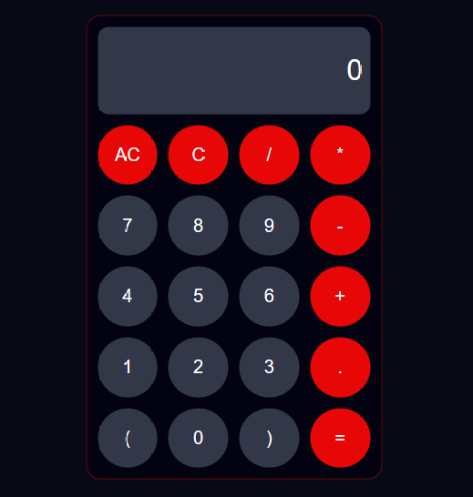

# calculador
 
 calculadora muy básica utilizando HTML, CSS y Javascript.

 Descripción general

-La calculadora está diseñada usando la cuadrícula CSS.

-La parte de la pantalla es una etiqueta de entrada única con una clase y una ID. La clase es para diseñar y la ID se -usa para acceder al elemento en JavaScript.

-Cada botón tiene una clase de 'símbolo' o 'número', que se utilizan con fines de diseño.
-Cada botón también tiene asignada una función onclick.

-La función de limpieza () se usa para borrar la pantalla al restablecer el valor de la etiqueta de entrada a una cadena vacía.

-La función show () se usa para escribir el valor correspondiente del botón en el que se hizo clic (representado como n en el archivo js) en la etiqueta de entrada.

-La función calc() evalúa el valor de la etiqueta de entrada y realiza los cálculos reales.

